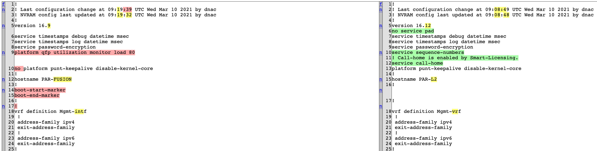

# Configuration Compliance Check
A tool designed to manage the configuration of devices connected to Cisco DNA Center. Its purpose is to extend the current Cisco DNA Center feature set in that domain, to do that we leverage the DNA Center APIs through a containerized Python web application. You can use this tool to schedule backup jobs for the configuration files, find a snippet inside the backed-up configuration files or compare two configuration versions side-by-side.

## Installation
Install Docker in order to build and run the image with the web application in a container. Once Docker is installed, type the following in a terminal:

1. `git clone https://github.com/yllwboy/CCC.git`
2. `cd CCC`
3. `docker-compose build`
4. `docker-compose up -d`
5. Access the web interface by opening <http://0.0.0.0:5000/> on a web browser.

If you wish to stop the tool, you can execute the following: `docker-compose down`

Careful, this command will stop any backup jobs from running as well.

## Getting started

### Log in page

Register a user and log in to start using the tool.

### Cisco DNA Center management page

From this page, you can access the backup jobs management page as well as the device management page. You can also trigger a backup of all devices connected to the DNA Center, this is useful when you need to perform operations on the latest version of the configuration files.

### Backup jobs page

You can configure your backup jobs here.

### Device management page

In the device management page, you can view and compare different configuration versions from the devices connected to the DNA Center which contain a configuration file the Cisco DNA Center can access. You also have an option to purge saved data for the DNA Center currently being used.

If you have set up RESTCONF for the selected DNA Center, you can restore a backed-up RESTCONF configuration version to the devices that support RESTCONF. Since RESTCONF is a protocol that requires connecting directly to the devices, firewalls might interfere with this functionality.

For unary operations such as view or restore, the left section will be the one that determines which version is selected.

Comparing two configuration versions will yield a diff view. It contains shortcuts next to the line numbers which allow you to explore all differences quickly.

### Search page

From the device management page, you can access the search page which allows you to find a snippet inside the configuration files backed-up by the tool. Running a search will show which files have a match, the list of matches for each file and a link that allows you to see the full file.

## To-Do
- Multi-line search
- Fix security issues with access to data from an account without the correct DNA Center credentials

## See also

[cisco-dnac-network-devices-cfg-backup-s3](https://developer.cisco.com/codeexchange/github/repo/robertcsapo/cisco-dnac-network-devices-cfg-backup-s3)