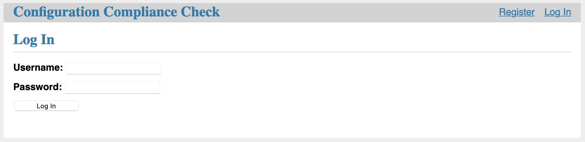
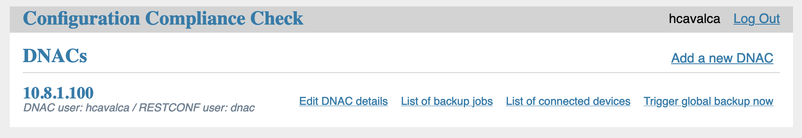
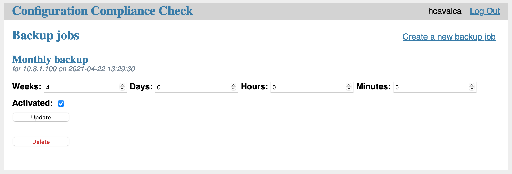
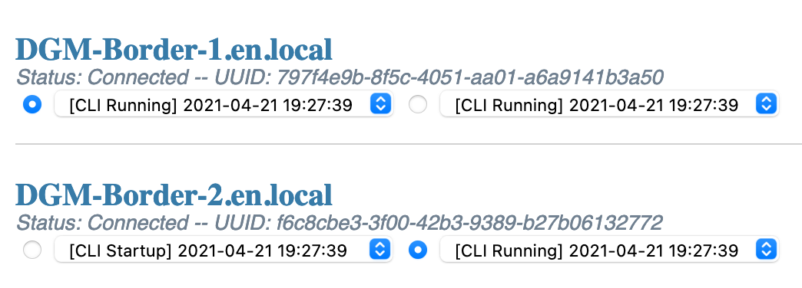
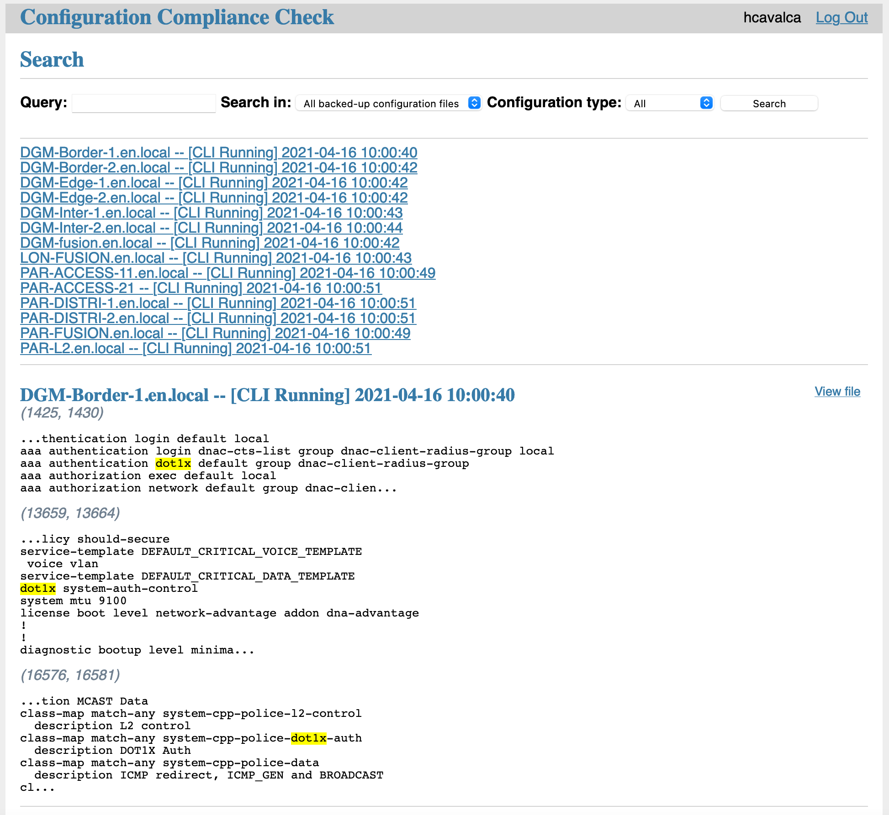

# Configuration Compliance Check
A tool designed to manage the configuration of devices connected to Cisco DNA Center through its APIs.

## Installation
1. `git clone https://github.com/yllwboy/CCC.git`
2. `cd CCC`
3. `docker-compose build`
4. `docker-compose up -d`
5. Access the web interface by opening <http://0.0.0.0:5000/> on a web browser.

## Getting started

Register a user and log in to start using the tool.

From this page, you can access the backup jobs management page as well as the device management page. You can also trigger a backup of all devices connected to the DNA Center, this is useful when you need to perform operations on the latest version of the configuration files.

You can configure your backup jobs in this page.

In the device management page, you can view and compare different configuration versions from the devices connected to the DNA Center which contain a configuration file the Cisco DNA Center can access.

From the device management page, you can access the search page which allows you to find a snippet inside the configuration files backed-up by the tool.

The results page shows which files have a match, the list of matches for each file and a link that allows you to see the full file.

## To-Do
- Multi-line search
- Restoring a configuration to a backed-up version using RESTCONF